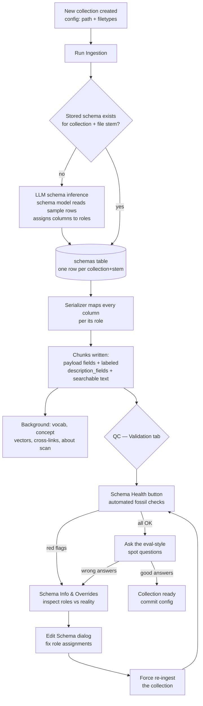

# Schema QC Guide — New Collection Onboarding

*What happens when you ingest a new collection, what each schema role does,
and how to decide whether the inferred schema is good or needs your hand.*

---

## 1. The flow

**Key fact:** inference runs **once** per (collection, file-stem) — after
that, every re-ingest **reuses the stored schema**. A bad inferred schema
persists until you edit it. That is how fossils happen.

---

## 2. What each role controls downstream

| Role | What it should hold | What consumes it |
|---|---|---|
| **Primary identifier** | The unique key (tag number, ticket id, NGC id, filename) | Exact lookups ("what is tag 22"), namespace matching, ownership guard, cross-links |
| **Reference identifier** | A pointer to *another* record's key | Relationship lookups |
| **Primary name** | The human name ("OrderQty", "Whirlpool galaxy") | Display, name-in-question matching, arbitration title rung, listings (`id — name`) |
| **Aliases** | Alternative names (M51, PB filenames) | "Also known as" rendering, alias resolution in questions |
| **Description** | The record's prose body | Renders, synthesis grounding |
| **Type** | **Short categorical codes** (Gx, Nb, Closed) — *never measures* | Filters ("how many galaxies"), concept grouping, value aliases |
| **Enum value / name** | Allowed-value lists (0=CUSIP…) | "What values can X have", reverse lookups ("what tag has value ISIN") |
| **Tags** | Topic labels | Concept-vector clustering |
| **Other** | Everything else worth keeping — **labeled and searchable** | description_fields renders, metadata filters, ticket summaries |

**Unmapped columns end up as unlabeled text only** — searchable but
renderable as bare values (the astro "GALAXY 13.498 47.2" disease).

---

## 3. QC decision table

| Symptom (Schema Health flag or spot question) | Likely cause | Fix |
|---|---|---|
| `null primary_name` on most rows | Name column not assigned to Primary name (user-defined CSV: `Field` was unmapped) | Edit Schema → assign → force re-ingest |
| `label-free rows` — renders show bare numbers | Columns sitting unmapped or description role empty with nothing in Other | Move meaningful columns into Other (labeled) |
| `numeric type role` — type values like 8.1, 8.4 | A measure column (v_mag) scrambled into Type | Remove it from Type; Type keeps only categorical codes |
| Counts return 0 for a category you can see | Type values are codes ('Gx') the question's word ('galaxies') can't ground | Add a **Value Alias** (System Config): word → code |
| Type field never enumerated in specs | More distinct values than `metadata_enum_values_cap` (config, default 30) | Raise the cap if the codes are legitimate |
| "No exact match" banner on an id you typed verbatim | Score dilution in a large collection (pre-2026-08-06) | Fixed — exact identity overrides confidence; if seen again, report |
| Right record, wrong sibling rendered | Multiple rows share one identifier (alias row + data row) | Expected — entity merge combines them; if not, check identifiers |
| Old collection keeps odd habits after edits | Stored schema reused; edits not re-ingested | Always **force** re-ingest after schema edits |

---

## 4. The onboarding ritual (five minutes)

1. Create collection → Run Ingestion → wait for background tasks
2. **Validation → Schema Health** → chase any red/orange line via table above
3. **Validation → Schema Info** → eyeball each role against 2-3 real rows
   (SQL inspector: `SELECT payload FROM chunks WHERE collection_name='X'` — does
   each role's field hold what it claims?)
4. Ask the four spot questions:
   - `what is <some identifier>` → full labeled record?
   - `how many <category word>` → grounded count? (if not: value alias)
   - `<identifier> details` → no banner on a verbatim id?
   - a free-text question about content → routed to the collection?
5. Wrong answers → Edit Schema → force re-ingest → repeat from 2
